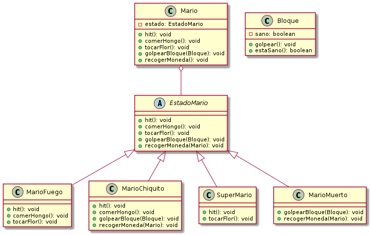

# Patrón State 

## Explicación

El patrón de diseño State resulta muy útil cuando necesitamos que un objeto actúe de diferente forma según el estado interno del mismo.

## Ventajas y Desventajas

Algunas de las ventajas que presenta este patrón de diseño son:

- Se localizan fácilmente las responsabilidades de los estados específicos, dado que se encuentran en las clases que corresponden a cada estado. Esto brinda una mayor claridad en el desarrollo y el mantenimiento posterior. Esta facilidad la brinda el hecho que los diferentes estados están representados por un único atributo (state) y no envueltos en diferentes variables y grandes condicionales.
- Hace los cambios de estado explícitos puesto que en otros tipos de implementación los estados se cambian modificando valores en variables, mientras que aquí al estar representado cada estado.
- Facilita la ampliación de estados.
- Permite a un objeto cambiar de clase en tiempo de ejecución dado que al cambiar sus responsabilidades por las de otro objeto de otra clase la herencia y responsabilidades del primero han cambiado por las del segundo.

No obstante, State tiene la siguiente desventaja:

- Se incrementa el número de subclases.

## Ejemplo

Por ejemplo, tenemos el objeto Mario que actuará diferente ante el ataque de un enemigo; si Mario está en estado `MarioFuego` o `SuperMario` este pasará a ir a un estado `MarioChiquito`, pero en cambio si Mario está en estado `MarioChiquito`, esté pasará a estar a un estado `MarioMuerto`.  
Siguiendo este mismo ejemplo, se mostrará como sería el diagrama de UML de un patrón State:

En este diagrama podemos ver que todos los estados que extienden de la clase “Estado” tienen el método implementado esAtacado() el cual devolverá, dependiendo su estado actual, otra instancia de otro estado diferente.  
Con el siguiente diagrama de estado también se podrá como el objeto Mario pasa por los diferentes diagramas de Estados.

 

